<div align="center">

# 🕊️ feige-fry-cards — 飞鸽卡片

**跨 Agent 会话战报直发插件：收尾自动汇总 · 飞书 CardKit v2.0 / Webhook · 钉钉 · Telegram 多渠道路由 · 纯标准库实现**

[](https://github.com/techysy/feige-fry-cards/releases/latest)
[](https://www.python.org/)
[](#快速开始)
[](#系列对齐fry-cards-家族)

[特性](#-特性) · [快速开始](#-快速开始) · [渠道矩阵](#-渠道矩阵) · [群路由](#-群路由项目--多目标-fanout) · [插件安装](#-插件安装一份插件五个宿主) · [WebUI 控制台](#%EF%B8%8F-webui-控制台) · [项目结构](#-项目结构)

</div>

> **这是什么**：一个专为各类 AI 编码 Agent（Claude Code、Codex、ZCode、kimi-code 等）打造的**会话结果收尾汇报插件**。当 Agent 完成任务会话收尾时，自动生成结构化摘要战报卡片投递至飞书、钉钉、Telegram 群组。  
> **核心定位**：不受制于宿主内置渠道的封闭限制，卡片形态与统计口径完全自主掌控；零外部依赖，纯 Python 标准库原生驱动。

---

## 🕊️ 系列对齐（fry-cards 家族）

| 仓库 | 标志 | 宿主 Agent | 形态与定位 |
| --- | --- | --- | --- |
| [hermes-fry-cards](https://github.com/techysy/hermes-fry-cards) | 🍟 薯条 | Hermes Gateway | 网关通道内 CardKit v2.0 流式交互卡片插件（系列源头） |
| [claw-fry-cards](https://github.com/techysy/claw-fry-cards) | 🍤 虾条 | OpenClaw | 飞书全功能通道插件（CardKit v2.0 打字机流式） |
| [zcode-feishu-bridge](https://github.com/techysy/zcode-feishu-bridge) | 🌉 | ZCode | 会话日志 Tail 桥接守护进程（流式进度卡片） |
| **feige-fry-cards**（本仓） | 🕊️ 飞鸽 | **Agent 无关** | **结果汇报插件**：会话收尾摘要卡直发各群（跨宿主统一收敛） |

---

## 🏗️ 架构与设计原则

<div align="center">

<picture>
  <source media="(prefers-color-scheme: dark)" srcset="assets/architecture.svg">
  
</picture>

</div>

### 核心设计原则
- 🎯 **摘要是战报，不是镜像**：卡片正文控制在 300 字级核心提炼，完整交互留在终端，杜绝冗长刷屏。
- 📊 **统计面板规范呈现**：遵循家族统一口径，在终态卡片底部附带紧凑脚注：`📦 项目 · 模型 · 💭思考 · 🔧工具 · 上下文 · 🎫输出 · ⏱️耗时`。
- 🛡️ **Fail-Open 稳态容错**：卡片生成或网络发信异常仅记录本地日志，**绝不反向阻断或拖垮 Agent 本身的执行进程**。
- 🔒 **密钥零泄露保障**：凭据全走系统环境变量或系统钥匙串，日志与 WebUI 严格脱敏，不落盘明文。
- 📦 **纯标准库零依赖**：基于 Python 标准库（`http.server`、`urllib` 等），无 `pip install` 外部三方包依赖负担。

---

## ✨ 特性

- 🤖 **一插件统驭五宿主**：无缝适配 Claude Code、Codex CLI、ZCode、kimi-code 及 Mirasim 托管会话。
- 🌐 **多渠道智能 Fanout**：支持按项目名称将战报广播（Fanout）到不同群组，单渠道故障互不连带。
- ⏱️ **精准口径与收尾去抖**：支持仅统计单轮用时与消耗（或全会话累计），内置 Debounce 机制防止频繁短交互刷屏。
- 🎛️ **内置轻量 WebUI 控制台**：单命令调起本地管理面板，提供凭据自检、群路由表单编辑与卡片实时预览。

---

## 🚀 快速开始

### 方式一：CLI 命令行直接发卡

```bash
# 1. 配置飞书机器人 Webhook 环境变量
export FEISHU_CARD_WEBHOOK="https://open.feishu.cn/open-apis/bot/v2/hook/xxxx"

# 2. 发送测试战报（先使用 --dry-run 查看装配载荷）
python feige.py send \
  --title "任务完成" \
  --body "**项目核心模块重构完毕**，所有测试均已通过。" \
  --project "feige-fry-cards" \
  --model "claude-sonnet-5" \
  --thinking 3 \
  --tools 8 \
  --context "42%" \
  --tokens 3200 \
  --elapsed "1m15s" \
  --status ok \
  --dry-run

# 3. 去掉 --dry-run 即刻向目标群发卡
```

### 方式二：启动 WebUI 本地控制台

```bash
python webui.py    # 默认绑定 127.0.0.1:8787，安全无外网暴露
```

---

## 📡 渠道矩阵

| 渠道标识 | 所需环境变量 | 展现形式 | 特性说明 |
| --- | --- | --- | --- |
| `feishu-webhook` | `FEISHU_CARD_WEBHOOK` / `FEISHU_WEBHOOK_URL`<br/>可选 `FEISHU_WEBHOOK_SECRET`（签名） | 飞书 CardKit 2.0 交互卡 | 配置最便捷，一次性交互卡片，开箱即用 |
| `feishu-cardkit` | `FEISHU_APP_ID` + `FEISHU_APP_SECRET`<br/>`FEISHU_NOTIFY_CHAT_ID`（目标群号） | 飞书原生卡片消息 | 走开放平台标准 App 凭据，直接向指定群分发终态卡片 |
| `dingtalk-webhook` | `DINGTALK_WEBHOOK`<br/>可选 `DINGTALK_SECRET`（加签） | 钉钉 Markdown 消息 | 标题行 + 结构化正文 + 状态脚注，自动处理加签鉴权 |
| `telegram` | `TELEGRAM_BOT_TOKEN` + `TELEGRAM_CHAT_ID` | Telegram 纯文本 | 严防 MarkdownV2 转义破坏，超长文本自动根据 UTF-16 截断 |

---

## 🔀 群路由（项目 → 多目标 Fanout）

在 `~/.feige-routes.json` 中配置群路由映射，支持根据 `--project` 名称将战报投递至不同群组：

```json
{
  "routes": {
    "feige-fry-cards": [
      { "channel": "feishu-webhook" },
      { "channel": "dingtalk-webhook", "webhook": "$DINGTALK_WEBHOOK" }
    ],
    "*": [
      { "channel": "feishu-cardkit" }
    ]
  }
}
```

- **路由匹配规则**：优先精确匹配项目名，未命中则降级采用 `"*"` 全局通配规则；无匹配时自动回落至单渠道行为。
- **环境变量安全引用**：路由文件内支持使用 `"$ENV_NAME"` 占位符引用外部凭据，防止密钥固化在配置文件中。

---

## 🔌 插件安装（一份插件，五个宿主）

仓库结构原生即插件。Claude Code、Codex 与 ZCode 均统一读取根目录下 `hooks/hooks.json` 挂载的 `hooks/stop.py` 调度入口：

```
feige-fry-cards/
├── .claude-plugin/              # Claude Code 与 Codex 插件描述清单
├── .zcode-plugin/               # ZCode 插件市场描述清单
├── hooks/
│   ├── hooks.json               # 统一 Stop Hook 触发声明
│   ├── stop.py                  # 宿主环境侦测与任务分发中心
│   └── stop-notify.mjs          # ZCode Rollout 会话日志转录解析
├── adapters/                    # 针对各 Agent 的转录提取适配器
│   ├── claude-code/
│   ├── codex/
│   └── kimi-code/
├── feige.py                     # 发卡核心引擎与 CLI
└── webui.py                     # 轻量设置面板服务
```

### 1. Claude Code
```bash
/plugin marketplace add /path/to/feige-fry-cards
/plugin install feige-fry-cards@feige-fry-cards
```
- 在插件设置中启用 `hook_notify`，并配置对应 Webhook 或应用凭据。会话收尾时自动发卡。

### 2. OpenAI Codex CLI
```bash
codex plugin marketplace add "/path/to/feige-fry-cards"
codex plugin add feige-fry-cards@feige-fry-cards
```
- 开关与配置直接通过环境变量注入（`FEIGE_HOOK_NOTIFY=1`）。与现存 `notify` 链互不干扰。

### 3. ZCode
- 在 ZCode 插件市场中添加本地目录，安装 `feige-fry-cards`。
- 在插件配置面板勾选 `hook_notify` 并填入 Webhook 地址。

### 4. kimi-code
在 `~/.kimi-code/config.toml` 中配置原生 Hook：
```toml
[[hooks]]
event = "Stop"
command = 'python "/path/to/feige-fry-cards/hooks/stop.py"'
timeout = 20
```

---

## 🎛️ WebUI 控制台

运行 `python webui.py` 即刻打开本地设置面板：

| 模块 | 功能 |
| --- | --- |
| **总览概况** | 实时显示 4 大渠道的环境变量配置状态（脱敏展示）与一键测试发卡能力 |
| **群路由编辑** | 可视化编辑 `routes.json`，保存前自动生成 `.bak` 备份并执行原子写入校验 |
| **卡片实时预览** | 输入参数即时查看装配后的 Dry-run 载荷与 HTML 样式渲染效果 |
| **接入状态诊断** | 自动自检当前环境中 Claude Code、Codex、ZCode 等宿主的插件注册情况 |

---

## 📁 项目结构

```
feige-fry-cards/
├── adapters/                    # 各宿主 Agent 转录与用量提取器
├── hooks/                       # 宿主生命周期 Hook 触发脚本
├── skills/                      # Agent 交互 Skill 提示词模板
├── tests/                       # 自动化单元测试套件
├── feige.py                     # 核心发卡引擎与 CLI 逻辑
├── webui.py                     # 本地 WebUI 独立服务
└── README.md                    # 项目文档
```

---

## 🧪 测试

```bash
# 纯标准库测试套件，内置模拟 Webhook 测试樁，不向外网发请求
python -m unittest discover -s tests -v
```

---

## 🔗 相关项目

- [🍟 hermes-fry-cards](https://github.com/techysy/hermes-fry-cards) — Hermes Gateway 飞书流式卡片插件
- [🍤 claw-fry-cards](https://github.com/techysy/claw-fry-cards) — OpenClaw 飞书通道插件
- [🌉 zcode-feishu-bridge](https://github.com/techysy/zcode-feishu-bridge) — ZCode 飞书流式卡片桥接守护进程
