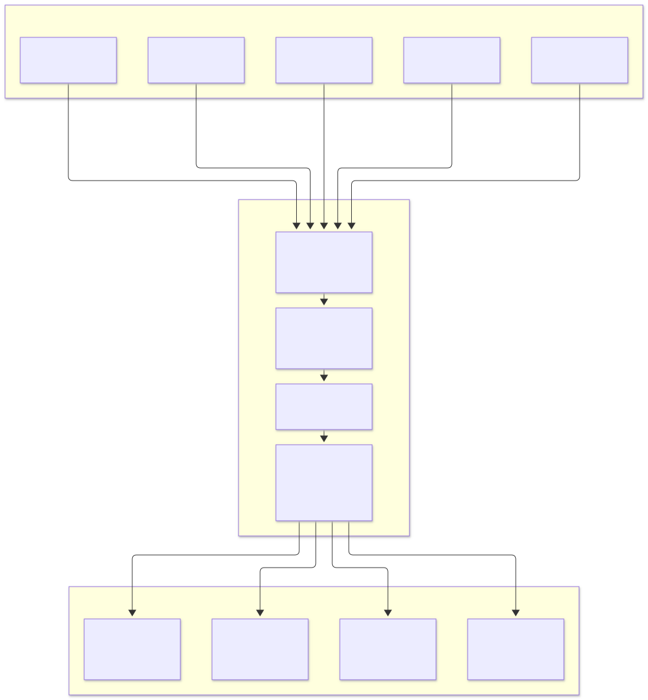

<div align="center">

# 🕊️ feige-fry-cards — 飞鸽卡片

**跨 Agent 会话战报直发插件：收尾自动汇总 · 飞书 CardKit v2.0 交互式卡片与长连接续跑 · Webhook / 钉钉 / Telegram 多渠道路由**

[](https://github.com/techysy/feige-fry-cards/releases/latest)
[](https://www.python.org/)
[](#快速开始)
[](#系列对齐fry-cards-家族)

[特性](#-特性) · [快速开始](#-快速开始) · [渠道矩阵](#-渠道矩阵) · [群路由](#-群路由项目--多目标-fanout) · [插件安装](#-插件安装一份插件五个宿主) · [Studio 设置页](#%EF%B8%8F-feige-studio-设置页) · [正文 LLM 总结](#-正文-llm-总结) · [环境变量](#%EF%B8%8F-环境变量参考) · [项目结构](#-项目结构) · [更新日志](CHANGELOG.md)

</div>

> **这是什么**：一个专为各类 AI 编码 Agent（Claude Code、Codex、ZCode、kimi-code 等）打造的**会话结果收尾汇报插件**。当 Agent 完成任务会话收尾时，自动生成结构化摘要战报卡片投递至飞书、钉钉、Telegram 群组。  
> **核心定位**：不受制于宿主内置渠道的封闭限制，卡片形态与统计口径完全自主掌控；零外部依赖，纯 Python 标准库原生驱动。

---

## 🕊️ 系列对齐（fry-cards 家族）

| 仓库 | 标志 | 宿主 Agent | 形态与定位 |
| --- | --- | --- | --- |
| [hermes-fry-cards](https://github.com/techysy/hermes-fry-cards) | 🍟 薯条 | Hermes Gateway | 网关通道内 CardKit v2.0 流式交互卡片插件（系列源头） |
| [claw-fry-cards](https://github.com/techysy/claw-fry-cards) | 🍤 虾条 | OpenClaw | 飞书全功能通道插件（CardKit v2.0 打字机流式） |
| [zcode-feishu-bridge](https://github.com/techysy/zcode-feishu-bridge) | 🌉 | ZCode | 会话日志 Tail 桥接守护进程（流式进度卡片） |
| **feige-fry-cards**（本仓） | 🕊️ 飞鸽 | **Agent 无关** | **结果汇报插件**：会话收尾摘要卡直发各群（跨宿主统一收敛） |

---

## 🏗️ 架构与设计原则

<div align="center">

<picture>
  <source media="(prefers-color-scheme: dark)" srcset="assets/architecture.svg">
  
</picture>

</div>

### 核心设计原则
- 🎯 **摘要是战报，不是镜像**：卡片正文控制在 300 字级核心提炼，完整交互留在终端，杜绝冗长刷屏。
- 📊 **统计只出一遍**：遵循家族统一口径，终态卡的统一折叠面板头承载紧凑统计：`模型 · 💭思考 · 🔧工具 · 上下文 · 🎫输出 · ⏱️耗时`（标题已含项目与宿主，面板头不重复；底部脚注行默认关，`FEIGE_FOOTER_ENABLED=1` 可恢复；面板/脚注字段各自独立配置）。
- 🛡️ **Fail-Open 稳态容错**：卡片生成或网络发信异常仅记录本地日志，**绝不反向阻断或拖垮 Agent 本身的执行进程**。
- 🔒 **密钥零泄露保障**：凭据走环境变量、插件设置或本地设置文件 `~/.feige-settings.json`（仅存本机），日志与 WebUI 严格脱敏，绝不入库；会话路径与 `session_id` 仅映射在 `~/.feige-sessions.json`，不上卡片公开字段。
- 📦 **核心零依赖 + 可选长连接增强**：发卡引擎（Webhook / CardKit / 钉钉 / Telegram）与 Studio 设置页仍基于纯 Python 标准库零依赖运行；仅开启飞书长连接交互回调（`WSClient`）时按需使用可选依赖 `lark-oapi>=1.4.0`，未安装时自动优雅降级。

---

## ✨ 特性

- 🤖 **一插件统驭六宿主**：无缝适配 Claude Code、Codex CLI、ZCode、kimi-code、Antigravity CLI（agy）及 Mirasim 托管会话。
- 🌐 **多渠道智能 Fanout**：支持按项目名称将战报广播（Fanout）到不同群组，单渠道故障互不连带。
- 🧠 **正文 LLM 总结**：正文超长不再硬截断——配置 OpenAI 兼容 API 后，后台发送进程先把冗长收尾汇报浓缩成战报摘要，未配置/失败自动退化为截断；宿主 hook 前台零网络阻塞。
- 🃏 **家族卡片规范 + 折叠面板 + 厂商 Logo**：对齐 `hermes-fry-cards` / `claw-fry-cards` 统一底部折叠面板（`collapsible_panel`）承载详细正文与工具摘要，内建 20 套厂商 Logo 资产与官方模型名映射（CardKit 自动上传缓存，Webhook 或未命中时保持干净无多余图标）。
- 🔁 **交互式追问与长连接续跑**：`feishu-cardkit` 渠道支持追问表单与防误触快捷按钮，配合飞书长连接（`WSClient` 接收 `card.action.trigger`，可随 `webui.py start` 保活）校验操作人白名单后，对 Claude Code / Codex CLI / ZCode / kimi-code 触发无头续跑并回写原卡。
- ⏱️ **精准口径与收尾去抖**：支持仅统计单轮用时与消耗（或全会话累计），内置 Debounce 机制防止频繁短交互刷屏。
- 🎛️ **feige Studio 设置页**：配置/预览/状态/群路由/接入自检五页签，渠道凭据、长连接与白名单、总结 LLM、行为开关全部表单化，写 `~/.feige-settings.json` 保存即生效，不用再碰环境变量。

---

## 🚀 快速开始

### 方式一：CLI 命令行直接发卡

```bash
# 1. 配置飞书机器人 Webhook 环境变量
export FEISHU_CARD_WEBHOOK="https://open.feishu.cn/open-apis/bot/v2/hook/xxxx"

# 2. 发送测试战报（先使用 --dry-run 查看装配载荷）
python feige.py send \
  --title "任务完成" \
  --body "**项目核心模块重构完毕**，所有测试均已通过。" \
  --project "feige-fry-cards" \
  --model "claude-sonnet-5" \
  --thinking 3 \
  --tools 8 \
  --context "42%" \
  --tokens 3200 \
  --elapsed "1m15s" \
  --status ok \
  --dry-run

# 3. 去掉 --dry-run 即刻向目标群发卡
```

### 方式二：打开 feige Studio 设置页（推荐）

```bash
python webui.py    # 默认绑定 127.0.0.1:8787，安全无外网暴露
```

渠道凭据（飞书 / 钉钉 / Telegram）、正文总结 LLM、行为开关全部表单化配置，
保存写 `~/.feige-settings.json` **即存即生效**，无需设置任何环境变量、无需重启宿主。

---

## 📡 渠道矩阵

| 渠道标识 | 所需环境变量 | 展现形式 | 特性说明 |
| --- | --- | --- | --- |
| `feishu-webhook` | `FEISHU_CARD_WEBHOOK` / `FEISHU_WEBHOOK_URL`<br/>可选 `FEISHU_WEBHOOK_SECRET`（签名） | 飞书 CardKit 2.0 卡片（含折叠面板） | 配置最便捷，支持底部折叠面板与状态着色，开箱即用 |
| `feishu-cardkit` | `FEISHU_APP_ID` + `FEISHU_APP_SECRET`<br/>`FEISHU_NOTIFY_CHAT_ID`（目标群号） | 飞书原生交互式 CardKit 2.0 卡片 | 支持厂商 Logo + 折叠面板 + 追问表单/快捷按钮，配合长连接可远程无头续跑（Claude Code / Codex / ZCode / kimi-code） |
| `dingtalk-webhook` | `DINGTALK_WEBHOOK`<br/>可选 `DINGTALK_SECRET`（加签） | 钉钉 Markdown 消息 | 标题行 + 结构化正文 + 状态脚注，自动处理加签鉴权 |
| `telegram` | `TELEGRAM_BOT_TOKEN` + `TELEGRAM_CHAT_ID` | Telegram 纯文本 | 严防 MarkdownV2 转义破坏，超长文本自动根据 UTF-16 截断 |

---

## 🔀 群路由（项目 → 多目标 Fanout）

在 `~/.feige-routes.json` 中配置群路由映射，支持根据 `--project` 名称将战报投递至不同群组：

```json
{
  "routes": {
    "feige-fry-cards": [
      { "channel": "feishu-webhook" },
      { "channel": "dingtalk-webhook", "webhook": "$DINGTALK_WEBHOOK" }
    ],
    "*": [
      { "channel": "feishu-cardkit" }
    ]
  }
}
```

- **路由匹配规则**：优先精确匹配项目名，未命中则降级采用 `"*"` 全局通配规则；无匹配时自动回落至单渠道行为。
- **环境变量安全引用**：路由文件内支持使用 `"$ENV_NAME"` 占位符引用外部凭据，防止密钥固化在配置文件中。
- **每群自动开启**：配了路由目标的项目，即使没开全局 `FEIGE_HOOK_NOTIFY` 也会每轮自动发卡
  （只有路由、不想要自动发送的项目，就别写进 routes）。Studio「群路由」页每张项目卡
  有「自动战报」勾选框，勾选结果存设置文件的 `auto_notify_projects`。
- **按项目覆盖接收群**：设置文件里写 `"feishu_chat_id__<项目名>": "oc_xxx"`
  （环境变量同名 `FEISHU_CHAT_ID__<项目名>`）。路由目标没写 `chat_id` 时用这个群
  （卡片的 ChatID 留空即可），没配则落回全局默认群。

---

## 🔌 插件安装（一份插件，六个宿主）

仓库结构原生即插件。Claude Code、Codex 与 ZCode 均统一读取根目录下 `hooks/hooks.json` 挂载的 `hooks/stop.py` 调度入口：

```
feige-fry-cards/
├── .claude-plugin/              # Claude Code 与 Codex 插件描述清单
├── .zcode-plugin/               # ZCode 插件市场描述清单
├── hooks/
│   ├── hooks.json               # 统一 Stop Hook 触发声明
│   ├── stop.py                  # 宿主环境侦测与任务分发中心
│   └── stop-notify.mjs          # ZCode Rollout 会话日志转录解析
├── adapters/                    # 针对各 Agent 的转录提取适配器
│   ├── antigravity/             # Antigravity CLI（agy）Stop hook 适配器
│   ├── claude-code/
│   ├── codex/
│   └── kimi-code/
├── feige.py                     # 发卡核心引擎与 CLI
└── webui.py                     # 轻量设置面板服务
```

### 1. Claude Code
```bash
/plugin marketplace add /path/to/feige-fry-cards
/plugin install feige-fry-cards@feige-fry-cards
```
- 在插件设置中启用 `hook_notify`，并配置对应 Webhook 或应用凭据。会话收尾时自动发卡。

### 2. OpenAI Codex CLI
```bash
codex plugin marketplace add "/path/to/feige-fry-cards"
codex plugin add feige-fry-cards@feige-fry-cards
```
- 开关与配置直接通过环境变量注入（`FEIGE_HOOK_NOTIFY=1`）。与现存 `notify` 链互不干扰。

### 3. ZCode
- 在 ZCode 插件市场中添加本地目录，安装 `feige-fry-cards`。
- 在插件配置面板勾选 `hook_notify` 并填入 Webhook 地址。

### 4. kimi-code
在 `~/.kimi-code/config.toml` 中配置原生 Hook：
```toml
[[hooks]]
event = "Stop"
command = 'python "/path/to/feige-fry-cards/hooks/stop.py"'
timeout = 20
```

### 5. Antigravity CLI（agy）
在 `<workspace>/.agents/hooks.json`（仅该项目）或 `~/.gemini/config/hooks.json`（全局）中配置原生 Stop hook：
```json
{
  "feige": {
    "Stop": [
      {
        "type": "command",
        "command": "python \"<repo>/adapters/antigravity/stop_notify.py\"",
        "timeout": 20
      }
    ]
  }
}
```
- hook payload 与转录 schema（`PLANNER_RESPONSE` 的 model/usage/thinking/tool_calls）
  按 agy 1.5.11 实证；💬/🔧/🎫/⏱️ 只算最后一轮，上下文水位 = input + cache_read。

---

## 🎛️ feige Studio 设置页

```bash
python webui.py [--port 8787]   # 前台跑（终端一关就没了）
python webui.py start           # 后台保活：脱离终端的守护进程拉起 worker，崩溃自动重启
python webui.py stop            # 停止（按 pidfile 整树杀）
python webui.py restart         # 重启
python webui.py status          # 探活：守护进程 / 端口 / 日志位置
```

保活机制：`start` 拉起脱离终端的守护进程（Windows `DETACHED_PROCESS` / POSIX 新会话，
控制台关了照常存活）→ 守护监视 worker，worker 活不过 3s 视为崩溃循环退避 5s 再拉，
正常退出立即拉起；端口被别的实例占走时守护功成身退。pidfile `~/.feige-studio.json`，
保活日志 `~/.feige-studio.log`（超 1MB 轮转）。

对标 fry-cards Studio 的设置体验，纯 Python 标准库（`http.server` 手写，零第三方依赖）。
**配置 / 预览 / 状态 / 群路由 / 接入自检** 五个标签页，所有配置项都表单化：

| 页面 | 功能 |
| --- | --- |
| **⚙️ 配置** | 分卡片表单：飞书（webhook / App ID / Secret / 接收群 + 交互开关 / 长连接 / 厂商 Logo / 操作人白名单 / 联调折叠指引）、**正文总结 LLM**、行为开关；钉钉与 Telegram 次要渠道采用可折叠 `fold-card` + 状态徽章，支持一键「保存并预览」 |
| **👁️ 预览** | 对标 `fry-cards Studio` 真实 CardKit v2.0 渲染器（`POST /api/preview`）：内置 6 种场景预设与厂商官方模型速选，仿真白底飞书卡片（色头、表格/代码 Markdown、底部 `collapsible_panel` + 厂商 Logo、追问表单与二次确认防误触弹窗模拟），附可折叠真实 dry-run JSON |
| **📊 状态** | 渠道凭据胶囊徽章、飞书长连接运行态与宿主 CLI 续跑能力探测、一键同步长连接与各渠道测试发卡 |
| **🧭 群路由** | 表单化编辑：缺 channel 拒绝、保存前 `.bak` 备份 + 原子写、`$ENV` 引用原样保留、保存后按路由语义冒烟 |
| **🔌 接入自检** | 只读检测 ZCode / Claude Code / Codex 插件注册与手动配置、kimi-code 手挂状态，未接入项给指引 |

**保存即生效**：配置写 `~/.feige-settings.json`（白名单键 + `.bak` 备份 + 原子写），
后台发送进程每次发卡重新读取，不必重启宿主。

**配置来源优先级**（`feige._env` 统一口径，全渠道生效）：真实环境变量 >
插件 userConfig（注入为环境变量）> 设置文件 `~/.feige-settings.json`。只在 Studio
里配就能跑；配了环境变量则环境变量优先（页面徽章标注来源，被遮蔽的键在页面上改动不生效）。

**安全**：只监听 `127.0.0.1`、无鉴权，勿改绑定地址或转发端口。密钥硬规则与
`feige.redact` 同级——任何响应体绝不回显 App Secret / bot token / webhook key /
LLM API key 的值：密钥输入框永远是空 password 框，只显「已配置」徽章，
**留空 = 不修改，勾选「清除」才删除**。

---

## 🧠 正文 LLM 总结

正文超过**总结触发字数**（默认 300 字，`llm_min_chars` 可调）或渠道上限时，不再
原样镜像/硬截断——若配置了总结 LLM，后台发送进程会先调用
**OpenAI 兼容 `chat/completions`** 把冗长收尾汇报浓缩成战报摘要：

### 配置方式一：写入本地设置文件 `~/.feige-settings.json`（推荐，保存即生效）

```json
{
  "llm_base_url": "http://192.168.31.101:20127/v1",
  "llm_api_key": "sk-...",
  "llm_model": "longcat/LongCat-2.5-Preview",
  "llm_max_chars": "400"
}
```

> **提示**：未显式指定 `"summarize": false` 时，配置了 `llm_api_key` 即默认自动开启总结。

### 配置方式二：环境变量方式（也可在 Studio「正文总结」卡里填）

```bash
export FEIGE_LLM_API_KEY="sk-…"                       # 配了才启用
export FEIGE_LLM_BASE_URL="http://192.168.31.101:20127/v1" # 10Router / 自建 / 代理网关端点
export FEIGE_LLM_MODEL="longcat/LongCat-2.5-Preview"  # 推荐使用长上下文快速推理模型
export FEIGE_LLM_MAX_CHARS="400"                      # 摘要目标字数
```

### 生产级长上下文网关（10Router）接入示例

以配合局域网 10Router AI 网关与 LongCat 模型为例：

1. **设置端点与凭据**：
   - `FEIGE_LLM_BASE_URL`: `http://192.168.31.101:20127/v1`
   - `FEIGE_LLM_API_KEY`: `sk-…`（你的网关密钥，勿把真实 key 写进公开文档）
   - `FEIGE_LLM_MODEL`: `longcat/LongCat-2.5-Preview`
2. **战报效果**：
   - 助手冗长的会话收尾汇报会被模型浓缩为清晰明了的要点战报，顶层只留摘要，原文在折叠面板里展开阅读。
   - 统一面板头承载规范的运行统计（标题已含项目与宿主，不重复）：
     ```text
     claude-code · Gemini 3.8-flash-n · 💭2 · 🔧22 · 1.0m/1.0m [███████▓] 97% · 🎫 2.9k · ⏱️ 8m 40s
     ```
   - 总结请求超时默认 45 秒（只在后台发送进程里等）；免费/慢速池偶尔超时仍 fail-open 回落截断原文，日志可辨（`llm summarize failed (falling back to clip)`）。

- **优雅退化**：未配 key、总结失败、或 dry-run/预览路径 → 自动退回硬截断，绝不卡发卡；
- **战报不是镜像**：启用总结后正文超过触发字数（默认 300 字，`llm_min_chars`，0 =
  只在超渠道上限才总结）就浓缩成摘要，中等长度的收尾汇报不再逐字上卡；
- **智能模型拉取**：Studio 设置面板支持与 ImgMark 一致的在线模型拉取（`/api/llm/models`），点击下拉即刻读取端点可用模型分组卡片，支持模糊搜索与一键点击选取；
- **零阻塞**：总结只在 `feige.py send` 后台进程执行，宿主 hook 前台不发任何 LLM 网络请求；
- **原文放行**：启用后各宿主适配器把更长原文（≤6000 字）交给总结器，未启用保持 300 字 teaser 老口径；
- **密钥安全**：API key 参与全链路打码（日志 / 错误信息 / 页面），绝不外泄。

---

## ⚙️ 环境变量参考

下表变量都有对应的 `~/.feige-settings.json` 键（用 Studio 表单化配置即可，环境变量优先）：

| 变量 | 用途 |
| --- | --- |
| `FEISHU_CARD_WEBHOOK` / `FEISHU_WEBHOOK_URL` | 飞书自定义机器人 webhook |
| `FEISHU_WEBHOOK_SECRET` | 飞书机器人开「签名校验」时的密钥（可选） |
| `FEISHU_APP_ID` / `FEISHU_APP_SECRET` | 飞书应用凭据（CardKit 通道） |
| `FEISHU_BASE_URL` | 默认 `https://open.feishu.cn` |
| `FEISHU_NOTIFY_CHAT_ID` | 飞书默认群 `oc_xxx`（CardKit 必配） |
| `DINGTALK_WEBHOOK` / `DINGTALK_SECRET` | 钉钉机器人 webhook / 加签密钥（`SEC` 开头，可选） |
| `TELEGRAM_BOT_TOKEN` / `TELEGRAM_CHAT_ID` | Telegram bot token / 目标 chat（群为负数 id） |
| `FEIGE_ROUTES_FILE` | 群路由文件（默认 `~/.feige-routes.json`） |
| `FEIGE_DEBOUNCE_SECONDS` | 收尾去抖秒数，默认 `0`（每轮收尾都发卡） |
| `FEIGE_STATS_SCOPE` | 统计口径 `turn`（单轮，默认）/ `session`（全程） |
| `FEIGE_LOG_FILE` | 后台发送进程日志（默认 `<临时目录>/feige.log`，超 1MB 轮转为 `.1`） |
| `FEIGE_LLM_API_KEY` / `_BASE_URL` / `_MODEL` / `_MAX_CHARS` | 正文总结 LLM 配置（见「正文 LLM 总结」） |
| `FEIGE_LLM_MIN_CHARS` | 总结触发字数阈值，默认 300；`0` = 只在超渠道上限才总结 |
| `FEIGE_READ_BODY_DELAY` | 后台发送进程开卡前重读转录的等待秒数（默认 1.5，`0` 关闭） |
| `FEIGE_SUMMARIZE` | `0`/`false` 显式关闭总结（即使已配 key） |
| `FEIGE_SETTINGS_FILE` | 设置文件路径（默认 `~/.feige-settings.json`） |
| `FEIGE_INTERACTIVE` | `feishu-cardkit` 交互式表单与快捷按钮开关（默认 `1`，`0` 关闭） |
| `FEIGE_WS_ENABLED` | 飞书长连接（WSClient）监听开关（`1` 开启，默认 `0`；可随 `webui.py start` 保活） |
| `FEIGE_ALLOW_USERS` | 交互操作人白名单（飞书 `open_id` / `user_id`，逗号或换行分隔；留空不限） |
| `FEIGE_VENDOR_LOGO` | 厂商家族 Logo 展示开关（默认 `1`，`0` 关闭自定义图标） |
| `FEIGE_PANEL_EXPANDED` | 底部统一折叠面板默认展开开关（默认 `0` 折叠） |
| `FEIGE_PANEL_FIELDS` | 统一面板头字段与顺序（逗号分隔；默认 `model,thinking,tools,context,tokens,elapsed`，不含项目名） |
| `FEIGE_FOOTER_FIELDS` | 底部脚注字段与顺序（逗号分隔；默认全字段含 `project`；仅脚注开启时可见） |
| `FEIGE_FOOTER_ENABLED` | 完成卡底部 hr+统计脚注行开关（默认 `0` 关——面板头已承载统计；钉钉/Telegram 静态版式不受影响） |
| `FEIGE_RESUME_TIMEOUT` | 无头续跑子进程超时秒数（`30~1800`，默认 `300`） |
| `FEIGE_SESSIONS_FILE` | 本地会话上下文映射文件（默认 `~/.feige-sessions.json`） |
| `FEIGE_HOOK_NOTIFY` | Stop hook 战报总开关（`1` 启用，默认关；kimi-code 注册即开启） |
| `FEIGE_DRY_RUN` | `1` 时 hook 只把卡片 JSON 打到 stderr，不发网络 |

---

## 🔁 交互式卡片与飞书长连接联调

1. **安装可选依赖**（仅开启飞书长连接监听时需要；未安装时发卡核心与其余渠道仍正常可用）：
   ```bash
   pip install ".[interactive]"   # 或 pip install lark-oapi>=1.4.0
   ```
2. **飞书开放平台配置**：
   - 应用凭证配置 `App ID` + `App Secret`，并在机器人「事件与回调 → 事件订阅方式」选择 **使用长连接接收事件**（无需公网回调域名）；
   - 添加卡片回传交互回调：`card.action.trigger`；
   - 确认应用权限包含发送消息（`im:message:send_as_bot`）、上传图片（`im:resource`）、CardKit 卡片管理，并已将应用机器人拉入目标群；发布应用版本使配置生效。
3. **启动保活守护监听**：
   - 在 Studio（`python webui.py start`）「配置 → 飞书渠道」填入 `App ID`、`App Secret`、`接收群 chat_id`，勾选 **启用 CardKit 交互式卡片** 与 **启用飞书长连接监听**，按需配置 **操作人白名单（`open_id`）** 后保存；
   - 或直接前台运行 `python feige.py listen`。

---

## 📁 项目结构

```
feige-fry-cards/
├── adapters/                    # 各宿主 Agent 转录与用量提取器
├── assets/vendor-logos/         # 厂商家族 PNG Logo 静态资产（与 hermes-fry-cards 同源）
├── hooks/                       # 宿主生命周期 Hook 触发脚本
├── skills/                      # Agent 交互 Skill 提示词模板
├── tests/                       # 自动化单元测试套件（全离线模拟，不发外网）
├── feige.py                     # 发卡核心引擎、家族卡片模型与 CLI
├── feige_interactive.py         # 本地安全会话映射、WSClient 长连接与无头续跑引擎
├── webui.py                     # feige Studio 本地设置页与长连接保活守护
├── pyproject.toml               # 包元数据与可选 [interactive] 依赖声明
├── CHANGELOG.md                 # 更新日志（Keep a Changelog 格式）
└── README.md                    # 项目文档
```

---

## 🧪 测试

```bash
# 纯标准库测试套件，内置模拟 Webhook 测试樁，不向外网发请求
python -m unittest discover -s tests -v
```

---

## 🔗 相关项目

- [🍟 hermes-fry-cards](https://github.com/techysy/hermes-fry-cards) — Hermes Gateway 飞书流式卡片插件
- [🍤 claw-fry-cards](https://github.com/techysy/claw-fry-cards) — OpenClaw 飞书通道插件
- [🌉 zcode-feishu-bridge](https://github.com/techysy/zcode-feishu-bridge) — ZCode 飞书流式卡片桥接守护进程
